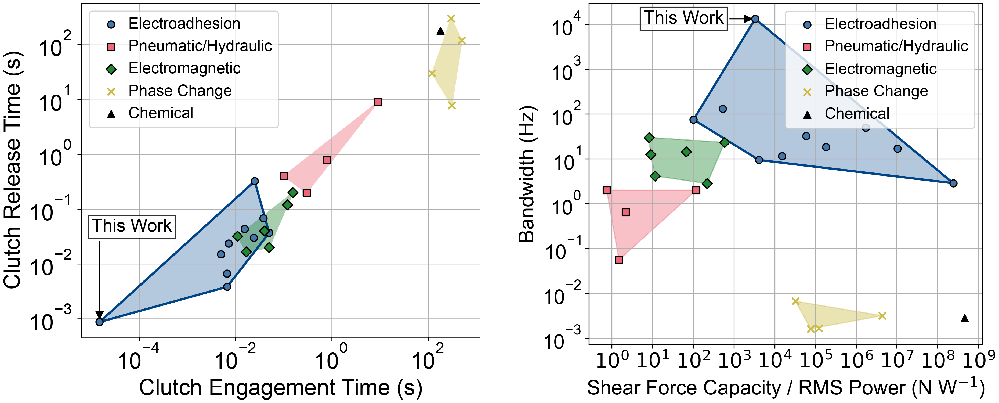
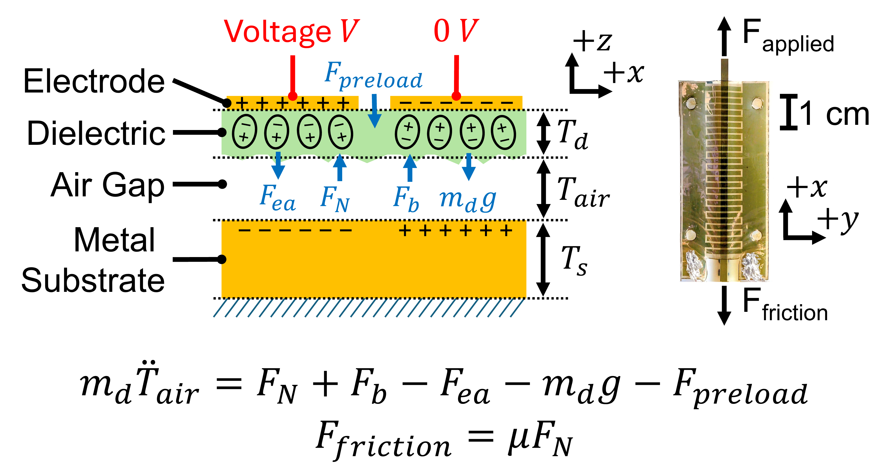
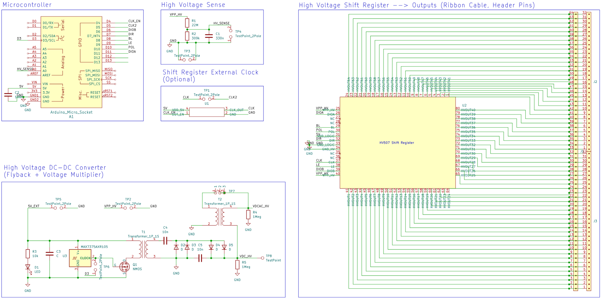

# Optimizing Electroadhesive Clutches for Sub-Millisecond Engagement and Release Times

Robots can use fast, controllable clutches for dynamic load bearing and programmable stiffness. Electroadhesion (EA) is a technology that offers these capabilities in an ultra-compact and flexible form factor, but its inconsistent dynamics limit real-world use.

To address this uncertainty, we built an analytical electromechanical dynamics model for electroadhesion, factoring in contact mechanics between the dielectric and substrate, polarization dynamics, and the drive circuitry’s rise and fall times. Dual optimization over both the electrical and contact mechanics allows us to improve clutch dynamics while maintaining high force output. The fastest clutches in our study can repeatably:
 * Engage in <15 μs (10x faster than prior work)
 * Release in <1 ms (17x faster than prior work)
 * Bandwidth >10 kHz (10x higher than prior work)
 * Recover after slip in <4 ms (roughly 5x faster than prior work)

In the main paper (open access link [here](https://arxiv.org/abs/2412.16803), journal link [here](https://www.sciencedirect.com/science/article/abs/pii/S235243162500094X)), we compare our model’s predictions for electroadhesive engagement and release times to experimental results across four operating and geometric design parameters with good conformity. We find that higher drive frequencies and narrower substrate aspect ratios enable significantly faster actuator response times, in particular improving release times.

We also compare our model’s predictions to broader experimental trends in prior literature, in particular explaining why larger substrate widths and lengths, lower voltages, and intermediate dielectric thicknesses result in larger release times. To our knowledge, this is the first analytical model for electroadhesion explaining these experimental trends.

## Methods (Modeling)

Our analytical model for electroadhesion dynamics included, from left to right in the equation above, the contact mechanics force between the dielectric and substrate, squeeze film damping, the electroadhesive attractive force, the dielectric's weight, and any external applied loads.

Using our free body diagram, we simulated how these parameters affect electroadhesion’s quasistatic and dynamic performance, and we validated these simulations via both finite element analysis and experimental testing.  

## Methods (Experimental)
To measure the engagement and release times of electroadhesive clutches down to the tens of microseconds, we built a custom tensile testing setup, as shown below.

We also designed a custom high voltage DC-DC converter and shift register circuit, the schematic of which is shown below.

## Navigating This Repository
Each of the figures in the ``scripts/`` folder are named according to the paper figure they generate. The experimental data that produced these figures are stored in the ``data/`` folder (mostly comprising log files for the ~400 tensile testing experiments reported on in this paper).

The code to run a tensile test is located in ``scripts/run_tensile_test.py``. This script expects that the code in the ``teensy/`` folder has also been loaded onto both the Teensy microcontrollers controlling the tensile testing setup and the shift register PCB.

CAD files for the tensile testing setup are located in the ``cad/`` folder, and KiCAD PCB files for the Microchip HV 507 shift register and power electronics circuit are located in the ``pcb/`` folder.

## Bibliography
[1] A. M. Rauf and S. Follmer, “Modeling the dynamics of sub-millisecond electroadhesive engagement and release times,” Extreme Mechanics Letters, vol. 79, p. 102382, Sept. 2025, doi: [10.1016/j.eml.2025.102382](https://doi.org/10.1016/j.eml.2025.102382). (Open Access arXiv link [here](https://arxiv.org/abs/2412.16803))

@article{Rauf_Follmer_2025, title={Modeling the dynamics of sub-millisecond electroadhesive engagement and release times}, volume={79}, rights={All rights reserved}, ISSN={2352-4316}, DOI={10.1016/j.eml.2025.102382}, abstractNote={Electroadhesive clutches are electrically controllable switchable adhesives commonly used in soft robots and haptic user interfaces. They can form strong bonds to a wide variety of surfaces at low power consumption. However, electroadhesive clutches in the literature engage to and release from substrates several orders of magnitude slower than a traditional electrostatic model would predict. Large release times, in particular, can limit electroadhesion’s usefulness in high-bandwidth applications. We develop a novel electromechanical model for electroadhesion, factoring in polarization dynamics, the drive circuitry’s rise and fall times, and contact mechanics between the dielectric and substrate. We show in simulation and experimentally how different design parameters affect the engagement and release times of centimeter-scale electroadhesive clutches to metallic substrates, and we find that the model accurately captures the magnitude and trends of our experimental results. In particular, we find that higher drive frequencies, narrower substrate aspect ratios, and faster drive circuitry output stages enable significantly faster release times. The fastest clutches have engagement times less than 15μs and release times less than 875μs, which are 10× and 17.1× faster, respectively, than the best times found in prior literature on centimeter-scale electroadhesive clutches.}, journal={Extreme Mechanics Letters}, author={Rauf, Ahad M. and Follmer, Sean}, year={2025}, month=sept, pages={102382} }
